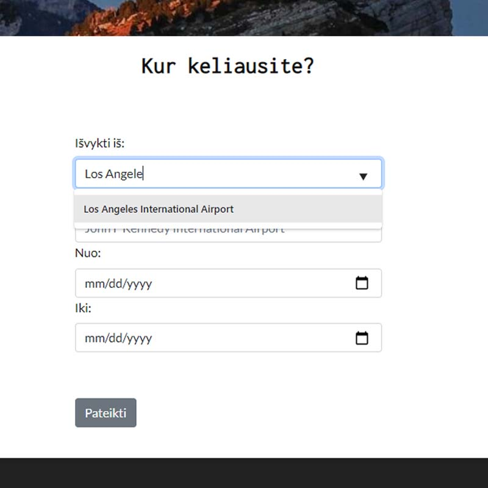
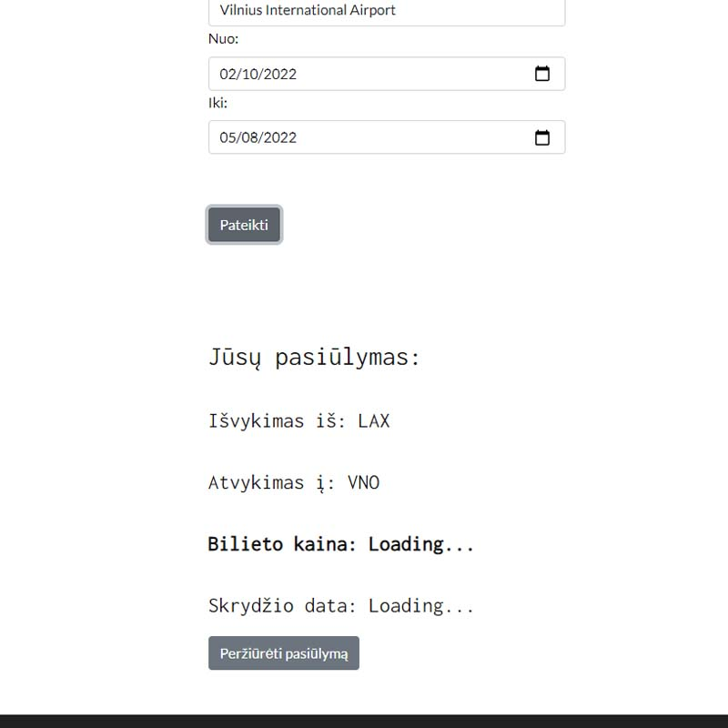

# Project Name
> Simple Web API project with Angular.
> Live demo [_here_](https://flycheap.netlify.app/).

## Table of Contents
* [General Info](#general-information)
* [Technologies Used](#technologies-used)
* [Features](#features)
* [Screenshots](#screenshots)
* [Setup](#setup)
* [Usage](#usage)
* [Troubleshoot](#troubleshoot)
* [Project Status](#project-status)
* [Room for Improvement](#room-for-improvement)


## General Information
- This project was made with the purpose to learn Web API, also deepen my Angular skills.
- FlyCheap app could be used to get the cheapest flight tickets within a selected date period. At this stage, API returns only one-way tickets within the selected time.
- This site uses two APIs to retrieve necessary information:
  - [Airports API](https://oro-uostu-api.herokuapp.com/) that returns JSON array with airport IATA code and name. Here is the example of return code:
  ```
    {
    iata: "VNO",
    name: "Vilnius International Airport"
    }
  ```
  - [Kiwi API](https://www.kiwi.com/en/) that provides ticket offers from provided data. 


## Technologies Used
- Angular CLI - version 12.2.7
- Bootstrap - version 5.1.3


## Features
- Suggested airport names.
- Travel tickets with a maximum of 3 stopovers.
- Travel offer is available as soon as the ticket price is shown on the screen. By pressing a button to view the offer customer is redirected to the Kiwi.com website to finish the booking form.

## Screenshots




## Setup
If you prefer to run this project locally:
1. Open the project locally.
2. Run `npm install` to install/update relevant dependencies.
3. Run `ng build` to build the project.
4. Run `ng serve` to run.


## Usage
1. Select departure and arrival airports from the given list. Make sure that you entered the full name of the airport.
2. Select both dates from the date selector.
3. After you press a button wait a couple of seconds before all data is received. 
4. When you see the numeric value for the ticket price, press the button below to view the travel offer.


## Troubleshoot
- User entered data, pressed a button to search for a ticket, but instead of the airport IATA code user sees "none":
  - The departure or arrival airport name was entered incorrectly. Make sure that you selected (pressed) airport from the given list.
- Airport input fields don't have a dropdown.
  - Most likely that is because of inactivity on the API website. It snoozed and needs reloading. Quickly refresh [this](https://oro-uostu-api.herokuapp.com/) site or/and try to input data once again.
- Data was entered, but the result button gives a blank page.
  - Make sure that the user sees the result ticket price and data in the result table. If "Loading..." is visible that means two things:
    1. API is taking longer to load. See the problem above.
    2. The route user entered requires more than 3 stopovers between airports and there are no available offers.


## Project Status
_in progress_


## Room for Improvement
Room for improvement:
- Improve the user experience
- Provide English version of the site

To do:
- Integrate more options for users e.g. number of stopovers
- Integrate ticket booking while still on the webpage
